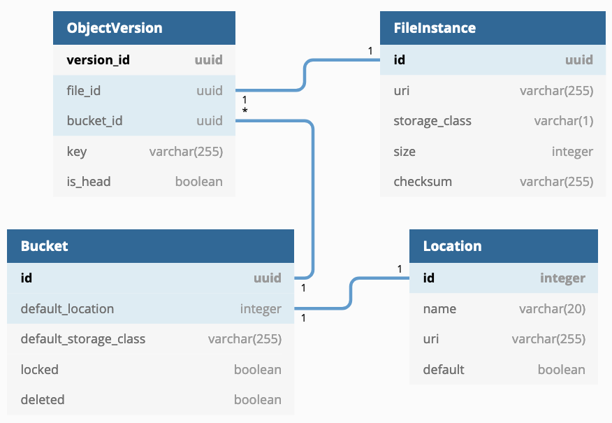

..
    This file is part of Invenio.
    Copyright (C) 2015-2019 CERN.

    Invenio is free software; you can redistribute it and/or modify it
    under the terms of the MIT License; see LICENSE file for more details.

Overview
========
Invenio-Files-REST is a files storage module. It allows you to store and
retrieve files in a similar way to Amazon S3 APIs. It provides a set of
features:

- An abstraction of physical files storage.
- Configurable storage backends with the ability to build your very own.
- A robust REST API.
- Highly customizable access-control.
- Secure file handling.
- Integrity checking mechanism.
- Support for large file uploads and multipart upload.
- Signals for system events.

The REST API follows best practices and supports, e.g.:

- Content negotiation and links headers.
- Cache control via ETags and Last-Modified headers.
- Optimistic concurrency control via ETags.
- Rate-limiting, Cross-Origin Resource Sharing, and various security headers.

Here is an introduction of the main concepts.

The physical layer
------------------

Provides physical access to files defining the storage locations and how to perform operations.

Location
++++++++
A :code:`Location` is a representation of a storage system. A location is described by its :code:`name`
and :code:`URI`. The URI could be a path in a local directory or a remote system.
For example, a location could have as a name :code:`shared-folder` and URI  :code:`/mnt/shared`.

Among all defined locations, one has to be set as the :code:`default`.

You can learn how to use Locations in the section :ref:`usage-create-location`.

Storage
+++++++
A :code:`Storage` provides the interface to interact with a :code:`Location` and perform basic
operations such as retrieve, store or delete files.

Multiple storage can be useful, for example, to represent offline/online location so that the system
known if it can serve files and/or what is the reliability.

By default, Invenio-Files-REST implements a storage for local files
:py:class:`invenio_files_rest.storage.PyFSFileStorage`. It controls how files are physically stored,
for example the folders and files structure.

You can create new storage implementations and configure Invenio to use any existing storage.
Check :ref:`usage-storage-backends` documentation for detailed instructions on how to build your own.

An example of a remote storage system is implemented in the module
`Invenio-S3 <https://invenio-s3.readthedocs.io/>`_ which offers integration
with any S3 REST API compatible object storage.

FileInstance
++++++++++++
A file on disk is represented by a :code:`FileInstance`. A FileInstance
describes the path to the file, the used storage, the size and the checksum of the
file on disk.

**To summarize**

FileInstances are stored on disk in a specified Location using Storage APIs.

The abstraction layer
---------------------

Provides an abstract way to logically represent, organise and manipulate files. This abstraction
layer allows to perform files operations without physically accessing files.

ObjectVersion
+++++++++++++
An :code:`ObjectVersion` is the logical representation of a version of a file and metadata at a
specific point in time. It contains the reference to the :code:`FileInstance` that
it corresponds. For example, the file name is stored in the ObjectVersion metadata.

.. note::
    File names could contain non-alphanumeric characters, which could be a problem depending on your file system.
    For example, a user could upload a file named :code:`thesis&first*v1.pdf`.

    In Invenio-Files-REST, the default :code:`Storage` will save the file in a tree of directories that are uniquely
    named. The file name will be changed to :code:`data` (with no extension) and the original file name will
    be stored in the metadata of the ObjectVersion.

    The final path to the file on disk will be something like :code:`/mnt/shared/2a/4f/39-5033-af42-k42m/data`.

When an ObjectVersion has no reference to a :code:`FileInstance`, it marks that the file has been
logically (and not physically) deleted. This is also known as
delete marker (or soft deletion).

Given multiple ObjectVersions of the same file, the latest (or most recent)
version is referred to as the :code:`HEAD`.

ObjectVersions are very useful to perform operations on file's metadata without
directly accessing to the storage. For example, given that the filename is part
of the ObjectVersion metadata, a rename operation is simply a database query to change its value.

Moreover, multiple :code:`ObjectVersion` can reference the same :code:`FileInstance`. This allows to perform
some operations more efficiently, such as create a snapshot without physically duplicating files or
migrating data.

**Let's see an example**

A user uploads a new file called :code:`thesis.pdf`.

With location and storage mentioned above, the file will be physically stored in :code:`/mnt/shared` in a tree
of folders and with filename :code:`data` (its FileInstance URI will be something like :code:`/<folders>/data`).

The logical representation of the file, the ObjectVersion, will contain the reference to that FileInstance
and it will also store the filename :code:`thesis.pdf`.

If, afterwards, the file is renamed to :code:`mythesis.pdf`, a new ObjectVersion will be created with the
new filename keeping the reference to the same FileInstance.

If the file is then removed, a new ObjectVersion will be created with no reference to any FileInstance, without
physically deleting the file on disk.

Bucket
++++++
A :code:`Bucket` is a container for :code:`ObjectVersion` objects.
Just as in a traditional file system where files are contained in folders, each
:code:`ObjectVersion` has to be contained in a :code:`Bucket`. The :code:`Bucket` has a
reference to the :code:`Location` where files are stored.

Buckets are useful to create collections of objects and to act on them. For example, bucket keeps track of the
total size of the object if contains and allows definitions of quotas.

A bucket can also be marked as deleted, in which case the contents become inaccessible.

**To summarize**

Bucket contains ObjectVersions, a version of a file and its metadata.
Each ObjectVersion has a reference to a FileInstance.

REST APIs
---------

Invenio-Files-REST provides a set of REST APIs to create or manage resources such as Buckets
or ObjectVersions. You can learn more about it in the :ref:`usage-rest-apis` section of the documentation.

