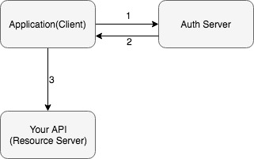
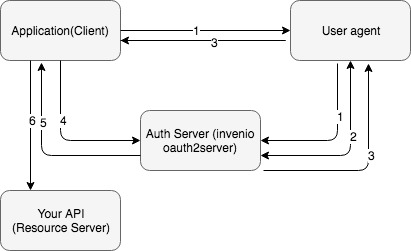
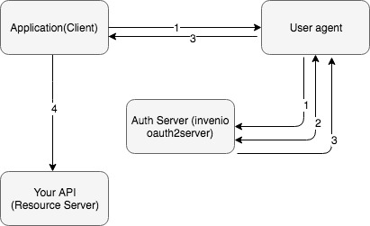

..
    This file is part of Invenio.
    Copyright (C) 2018 CERN.

    Invenio is free software; you can redistribute it and/or modify it
    under the terms of the MIT License; see LICENSE file for more details.

Overview
========
Understanding API Authentication in Invenio
-------------------------------------------
A user can make authenticated requests against the Invenio REST APIs using two
different methods:

**Session**

A user who logged into an Invenio application in the browser obtains a session.
The session is implemented via Secure HTTP-only cookies, to ensure that the
cookie containing the session identifier is only submitted over HTTPS, and that
JavaScript applications running in the browser cannot access the cookie. When
the session cookie is provided in an HTTP request to the API, the cookie is
used to authenticate the user.

Because the session-based authentication is primarily used from a browser, it is
important to protect the API against Cross-Site Request Forgery (CSRF) attacks.
Invenio protects against CSRF-attacks by embedding a short lived CSRF-token
into the HTML DOM tree from the server-side. This CSRF-token is then read by a
JavaScript application and added to the HTTP request header. Thus, the HTTP
request header will include both the session cookie as well as the CRSF-token.
The CSRF-token is implemented via a JSON Web Token (JWT).

The session identifier stored inside the session cookie is furthermore protected
in a way, so that it must be used from the same machine and same browser.

**Access token**

An access token (or API key) can also be used to make authenticated requests
to the API. Access tokens are primarily used by machines accessing the
Invenio REST API, contrary to session-based authentication which is primarily
used in browsers by humans. The access tokens can also be used to delegate user
rights to a third-party application without exposing user credentials. This
delegation of rights can further be scoped to specific parts of the API, to not
give full access to third-party applications.

Access tokens can be obtained in different ways. A user may for instance
manually create an access token via the user interface, or e.g. a third-party
application can initiate an OAuth 2.0 authentication flow that eventually
provides them with an access token. The different scenarios for how to obtain an
access token are explained in detail further below.

Obtaining a session and JWT token
~~~~~~~~~~~~~~~~~~~~~~~~~~~~~~~~~
To obtain a session:

1. The user logs in by providing his login credentials
2. A new session is created

After this point we can add a CSRF token to not be prone to CSRF attacks.

3. For the CSRF token we can use the JWT as it contains user information and
   it fulfills the key properties of a CSRF token

By default, the JWT is embedded in the DOM tree using the Jinja context
processor ``{{jwt()}}`` or ``{{jwt_token()}}`` from a template.
By passing the JWT with each request, the user state is never saved in
server memory making this a stateless authentication mechanism. Then the
server just looks for and validates the JWT in the ``Authorization``
header, to allow access to the protected resources.

Obtaining an access token
~~~~~~~~~~~~~~~~~~~~~~~~~
In the case where the client requesting an access token is the resource owner,
the token will allow all permissions the user would have by providing his
username and password credentials. For example to use a personal access token
to send REST API requests, the procedure is the following:

1. First the user logs in and navigates to his profile page
2. Clicks on ``Create New Personal Token``
3. Stores the generated string in a variable ``$ACCESS_TOKEN``
4. Now requests can be made to protected resources by passing
   it as a parameter, e.g.

.. code-block:: console

    curl -XPOST -d '{some_record_data}' $HOST:5000/records/
    \?access_token=$ACCESS_TOKEN

In the case where the client is a third party, a web application for example
requesting access to an owner's protected resources, the procedure is
different. Let's see the case where a user goes to ``example.com`` and
chooses to log in via Invenio. The setup to enable this is as follows:

1. First, the application has to be registered as an authorized application
2. This can be done by the settings page, as it was for the personal access
   tokens, but now clicking on ``New Application``
3. After filling out the form and setting a ``Redirect URL``, a ``Client ID``
   and ``Client Secret`` are generated
4. These have to be set in the ``example.com`` application, in order to be
   able to make requests

Now a user can navigate to ``example.com`` and can select to log in via
Invenio. The procedure will be along the following lines:

5. A request is sent to the ``/authorize`` endpoints in Invenio from
   ``example.com`` with the ``Client ID`` and ``Client Secret`` passed
   as parameters
6. The user is redirected to an Invenio page where he is asked to log in
7. After logging in, a form shows what type of permissions the ``example.com``
   is requesting, and the user can decide to authorize it
8. Invenio redirects back to the ``Redirect URL`` set for this application,
   and returns an authorization code with a limited lifespan
9. The authorization can be used to obtain an access token by querying the
   ``/token`` endpoint in Invenio
10. ``example.com`` can now send requests to Invenio using this access token to
    access resources available to the user

Oauth2 flows
------------
There are different Oauth2 flows you should use depending mostly on the type of
your ``Client`` but also in other parameters such as the level of trust of the
``Client``. By different flows we mean that Oauth2 provides different grant
types that you can use. ``Grant types`` are different ways of retrieving an
``access token`` that eventually will lead you to access a protected resource.
Before analyzing the different Oauth2 flows let's see some Oauth2 terminology:

-   **Resource owner**: the entity that has the
    ownership of a protected resource. Can be
    an the application itself or an end user.
-   **Client**: an application that requests
    access to a protected resource on behalf of the resource
    owner.
-   **Resource server**: the server in which
    the protected resource is stored. This is the API you want
    to have access.
-   **Authorization server**: this is the
    server that authenticates the resource owner and issues an
    access token to the Client after getting proper
    authorization. In our case this is the OAuth2Server
    package.
-   **User Agent**: the agent used by the
    Resource Owner to interact with the Client, for example a
    browser or a native application.

The crucial thing to decide which Oauth2 grant type is most
suitable for you to use, as we said, is the type of your
client. Having in mind that we define the below 4 cases.

Client is the resource owner
~~~~~~~~~~~~~~~~~~~~~~~~~~~~
This is the case that the application that requests access to a
protected resource is also the owner of this resource. In that
case the application holds the ``Client ID`` and the ``Client
Secret`` and uses them to authenticate itself through the
authentication server and retrieve the access token. Such an
example could be a service running on the client server and
trying to get access to a resource on the same server. A typical
flow diagram is the following:

1. Application authenticates itself using Client     ID and Secret.
2. Retrieves an access token.
3. Uses the token to access the protected            resource.

If this case is the one that suits your needs then you should
use the ``Client Credentials grant``.

Client is an application running on a web server
~~~~~~~~~~~~~~~~~~~~~~~~~~~~~~~~~~~~~~~~~~~~~~~~
In that case you should use the ``Authorization Code grant``. In
this flow the Client requests an access token from the
authorization server in order to access the protected
resource. The Client gets an access token, and optionally a refresh token,
after first the resource owner is authorized.

1. Application redirects the user agent to the       /authorize url to authenticate itself
   through the authorization server.
2. The end user the first time is provided with a    consent page that asks for specific
   permissions to be granted to the application (e.g. user email, list of contacts etc.)
3. After the user confirms the access grant the      authorization server returns an
   authorization code to the application.
4. With the possession of the authorization code,    the application asks from the
   authorization server an access token in exchange for its code.
5. The authorization server validates the code       sent from the application and if is valid
   issues an access token back to it. Optionally can return also a refresh token that is used by the application when the access token is expired.
6. The application uses the retrieved access         token to eventually consume the protected
   resources stored in the resource server.

Client is a Single Page Application
~~~~~~~~~~~~~~~~~~~~~~~~~~~~~~~~~~~
If your application is a single page application then you should use the
``Implicit grant``. In this grant type instead of getting
first an authorization code in order to ask for an access token
you directly ask for the token. In the plus side this method is
faster as there is no need for round trip to get an access
token. However, there is a security risk as the access token is exposed to
the user agent (e.g. the user's browser). Also you should consider that the
``Implicit grant`` doesn't return refresh tokens.

1. Application redirects the user agent to the       /authorize url to authenticate itself through     the authorization server.
2. The end user the first time is provided with a    consent page that asks for specific
   permissions to be granted to the application (e.g. user email, list of contacts etc.)
3. After the user confirms the access grant the      authorization server returns an
   access token to the application. Note that in this flow no refresh token is issued and the access_token is short lived.
4. The application uses the retrieved access         token to eventually consume   the protected
   resources stored in the resource server.

Client is trusted with user Credentials
~~~~~~~~~~~~~~~~~~~~~~~~~~~~~~~~~~~~~~~
In that case probably you should use the ``Resource Owner
Password Credentials Grant``. In this flow the end user trusts
the ``Client`` with his/her credentials in order to be used by the
client to authenticate him/her through the authorization server.
This grant type is disabled by default in
Invenio-OAuth2Server, and should only be used if there is no
possibily to use another redirect-based flow.
