# Registering a Crossref DOI from WEKO3

How a repository is set up so that granting a Crossref DOI in the workflow
also registers that DOI with Crossref, and what each screen looks like while
it happens.

Every screenshot below was taken by the Playwright capture in
[`e2e/`](./e2e/) against a running WEKO3, so the screens are the ones the
application actually shows rather than a drawing of them. To reproduce or
refresh them, see [Reproducing this manual](#reproducing-this-manual).

- Applies to: `feature/nii_WACREN_crossref_doi` (implementation commit
  `23af9ad4`)
- Related design notes: [`WACREN_crossref.md`](../../WACREN_crossref.md),
  [`WACREN_doi_registration.md`](../../WACREN_doi_registration.md)

---

## What this feature does

Before this change, granting a DOI in WEKO3 wrote the DOI into the item
metadata and into the PID store, and stopped there — no registration agency
was ever contacted. The item claimed a DOI that did not resolve.

With Crossref registration enabled, the end of the workflow's **Approval**
step also hands the DOI to Crossref: WEKO builds a Crossref deposit document,
posts it to Crossref's deposit endpoint, and then polls Crossref's submission
log until Crossref says whether it accepted the DOI. All of that happens in
background tasks, so a registration agency that is slow or down can never
make an item registration fail.

### What it does not have yet

There is **no administration screen for the deposits**. Whether Crossref
registration is on, and the credentials it uses, are settings in
`invenio.cfg`; the state of each deposit is read from the command line. That
is why this manual mixes screenshots with configuration files and terminal
output.

---

## Before you start

You need a Crossref account that may deposit under your prefix. Crossref runs
a test system at `https://test.crossref.org` that behaves like production but
writes to a test database and does not register the DOIs with Handle — so
DOIs deposited there never resolve. Use it while setting this up.

---

## Step 1 — Configure Crossref in `invenio.cfg`

Deposits are off until `WEKO_CROSSREF_ALLOW_REGISTER_DOI` is true, and stay
off — with a line in the log saying which settings are missing — until every
credential is filled in.

```python
# Turn Crossref deposits on. Off by default.
WEKO_CROSSREF_ALLOW_REGISTER_DOI = True

# Crossref's test system. Production is https://doi.crossref.org/servlet/...
WEKO_CROSSREF_DEPOSIT_URL = 'https://test.crossref.org/servlet/deposit'
WEKO_CROSSREF_SUBMISSION_LOG_URL = \
    'https://test.crossref.org/servlet/submissionDownload'

# The Crossref account that may deposit under your prefix.
WEKO_CROSSREF_LOGIN_ID = 'your-crossref-user'
WEKO_CROSSREF_LOGIN_PASSWD = 'your-crossref-password'

# Written into the <head> of every deposit document.
WEKO_CROSSREF_DEPOSITOR_NAME = 'Your Repository'
WEKO_CROSSREF_DEPOSITOR_EMAIL = 'repository@example.org'
WEKO_CROSSREF_REGISTRANT = 'Your Institution'

# 'posted_content' deposits every item as posted_content and keeps the
# mapping small; 'auto' follows the resource type, so a journal article with
# a source title is deposited as a Crossref journal_article.
WEKO_CROSSREF_RECORD_TYPE_POLICY = 'auto'
```

Optional, all with usable defaults:

| Setting | Default | What it controls |
| --- | --- | --- |
| `WEKO_CROSSREF_TIMEOUT` | `30` | Seconds to wait on each HTTP call to Crossref |
| `WEKO_DOI_SUBMIT_COUNTDOWN` | `10` | Seconds after approval before the deposit is sent |
| `WEKO_DOI_FIRST_POLL_DELAY` | `60` | Seconds before the submission log is read the first time |
| `WEKO_DOI_POLL_INTERVAL` | `300` | Seconds between later reads of the submission log |
| `WEKO_DOI_MAX_POLL_ATTEMPTS` | `20` | Reads before the deposit is left as `unknown` |
| `WEKO_DOI_MAX_RETRY` | `3` | Retries of a deposit that failed for a temporary reason |
| `WEKO_DOI_RETRY_COUNTDOWN` | `60` | Seconds between those retries |
| `WEKO_DOI_NOTIFY_EMAIL` | `None` | Address, or list of addresses, told when a deposit fails |

Restart the web and worker processes after editing the file.

---

## Step 2 — Enable the Crossref grant and set the prefix

**Administration → Setting → Identifier.** The list shows one row per
repository, with the prefix registered for each agency and whether that agency
is enabled.

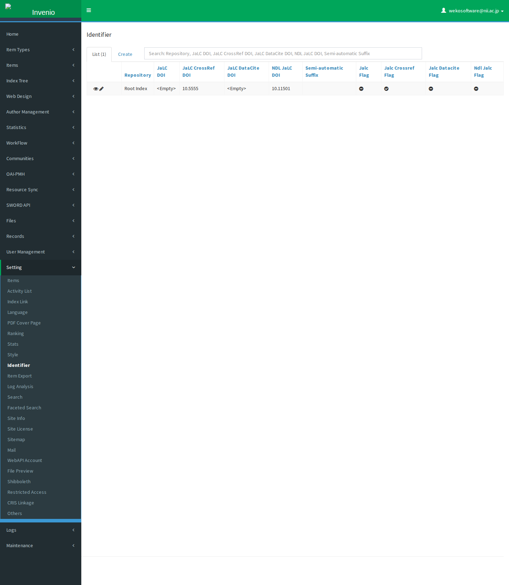

Open the row with the pencil icon. Two things have to be done here, in this
order:

1. In **Enable/Disable**, select `JaLC CrossRef DOI` in the *Disable* list and
   move it to *Enable* with the `>` button. The prefix box stays read only
   until you do.
2. Enter your Crossref prefix in **JaLC CrossRef DOI**. Every Crossref DOI
   this repository grants is built from it. The screenshot uses `10.5555`,
   the prefix Crossref documents for examples.

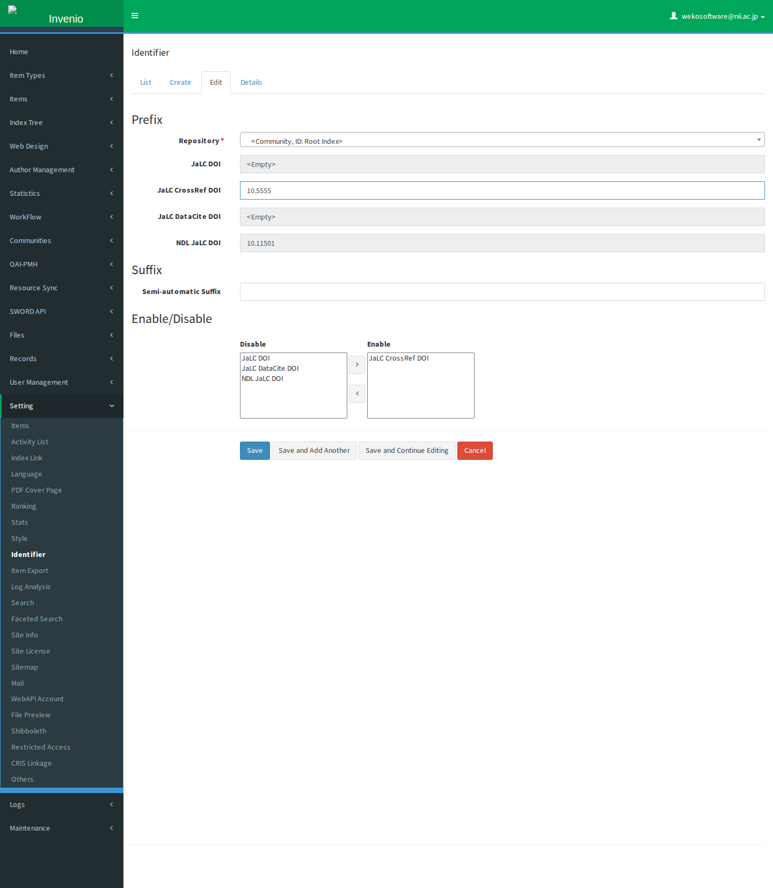

Save. The list now shows the prefix and the Crossref flag enabled.

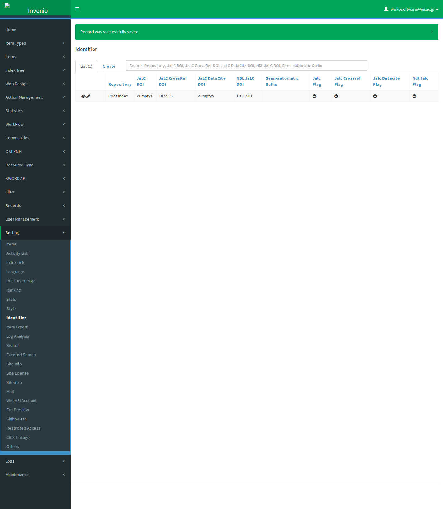

> The field is named `jalc_crossref_doi` because WEKO was originally written
> for Japanese institutions registering Crossref DOIs through JaLC. It is the
> same field whether you deposit through JaLC or, as here, directly with
> Crossref.

---

## Step 3 — Register the item

**WorkFlow → New Activity**, then **New** on the workflow you register with.
The screenshots use the default full item type.

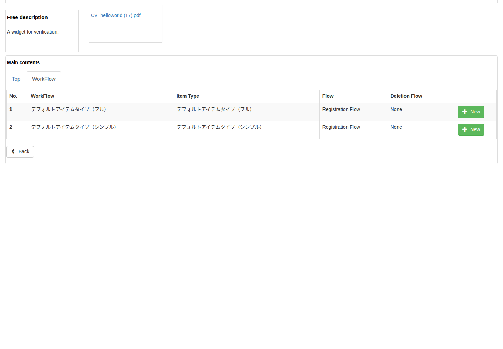

Fill in the item. A Crossref DOI is only granted to an item that carries the
metadata Crossref needs — see
[What Crossref requires](#what-crossref-requires) for the full list. For a
journal article that is:

| Field | Value in the screenshots |
| --- | --- |
| File | any file — a DOI grant is refused without one |
| PubDate | `2026-09-02` |
| Title / Language | `Registering a Crossref DOI from WEKO3` / `en` |
| Resource Type | `journal article` |
| Source Title / Language | `Journal of WEKO Studies` / `en` |
| Source Identifier / Type | `0317-8471` / `ISSN` |
| Date / Date Type | `2026-09-02` / `Issued` |

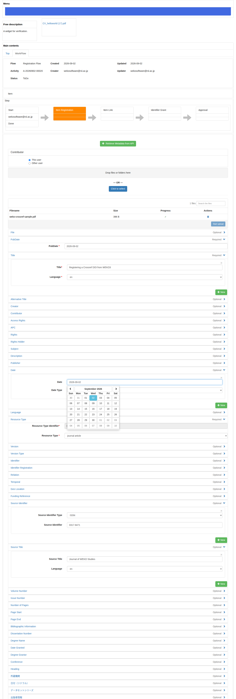

Next opens the index tree. Tick the index the item belongs to; the Next button
is refused while **Designate Index** is empty.

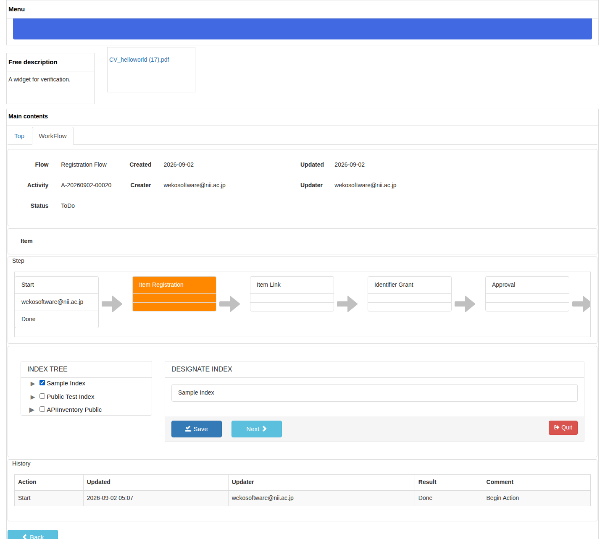

---

## Step 4 — Item Link

Nothing to do for a DOI. Next.

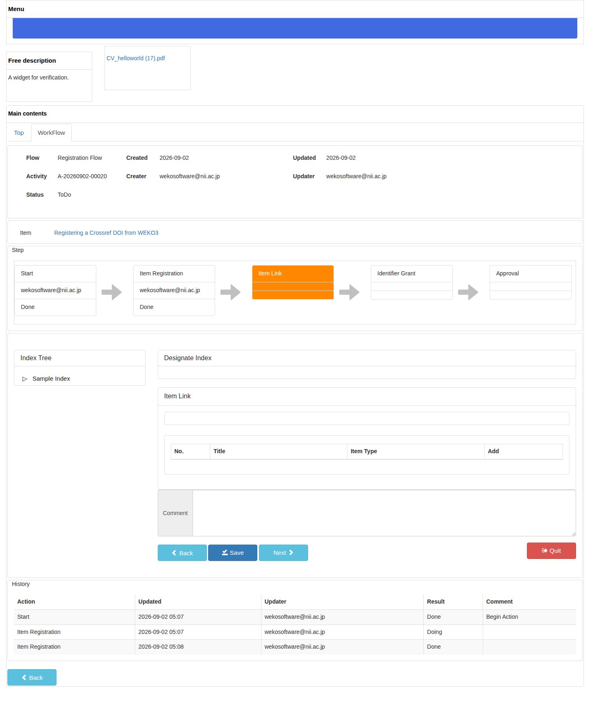

---

## Step 5 — Grant the Crossref DOI

The **Identifier Grant** step offers the agencies enabled in step 2, each with
the DOI it would grant. Only `Not Grant` and `JaLC CrossRef DOI` are offered
here because Crossref is the only agency enabled.

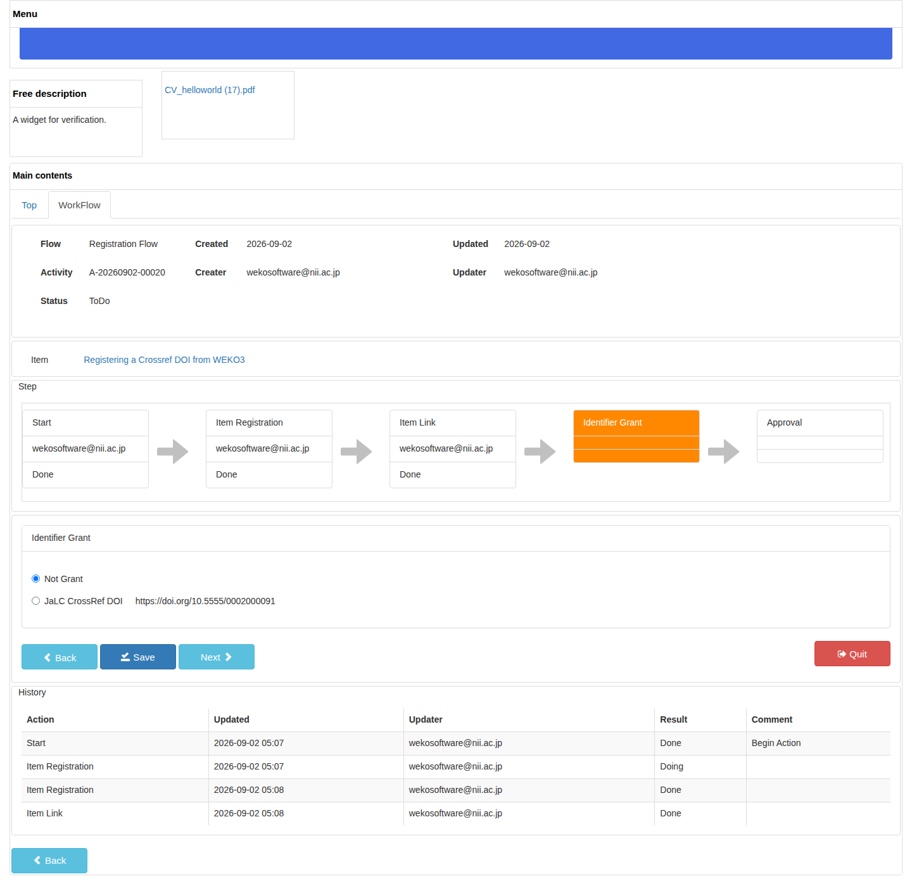

Select **JaLC CrossRef DOI**. The DOI beside it — prefix from step 2, suffix
built from the item — is the DOI that will be registered.


If the item is missing metadata Crossref needs, Next does not go on: the
activity returns to **Item Registration** with the banner *PID registration
does not meet the conditions* and the step marked `Retry`. Fix the metadata
and come back.

---

## Step 6 — Approve

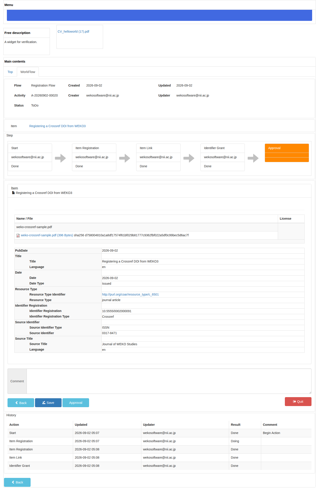

Approval is where the DOI is granted, and where the Crossref deposit is
requested. The activity ends normally whatever Crossref does next.

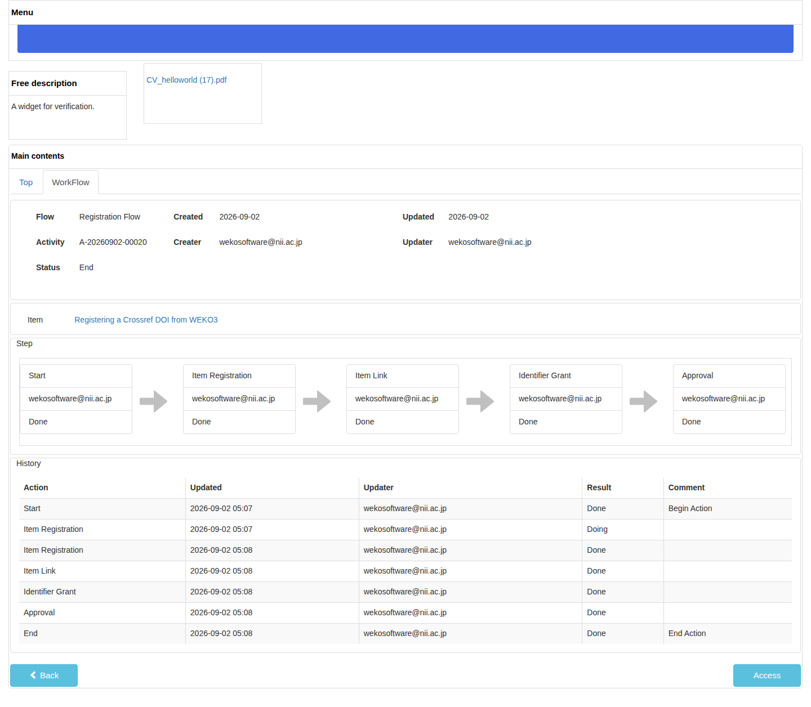

---

## Step 7 — Check the DOI on the item

Open the item from the activity. **Identifier Registration** now holds the DOI
and the agency it was registered with.

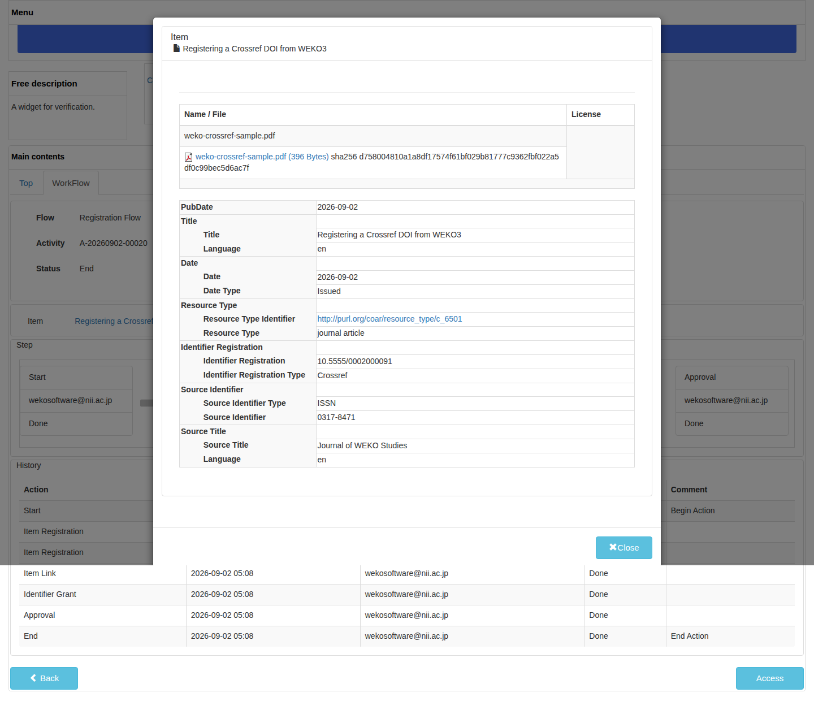

---

## Step 8 — Check the deposit

The deposit itself is not on any screen. Read its state from the command line
inside the web container:

```console
$ invenio workflow doi list
     7  Crossref   success    10.5555/0002000091                       Crossref registered the DOI.
     6  Crossref   success    10.5555/0002000090                       Crossref registered the DOI.
```

The columns are the log id, the agency, the state, the DOI and the last
message. `--status failure` narrows the list to one state and `--limit`
changes how many rows are shown (50 by default).

### What the states mean

| State | Meaning | What happens next |
| --- | --- | --- |
| `pending` | The row exists; the deposit has not been sent | The task sends it after `WEKO_DOI_SUBMIT_COUNTDOWN` |
| `submitted` | Crossref received the submission | Polled until Crossref judges it |
| `success` | Crossref registered the DOI | Nothing |
| `failure` | Crossref, or WEKO's own validation, rejected it | Fix the metadata and resend |
| `unknown` | Crossref had not judged it after `WEKO_DOI_MAX_POLL_ATTEMPTS` | Check the submission on Crossref's side |

A deposit that fails for a temporary reason — Crossref unreachable, a 5xx, an
authentication error — is retried `WEKO_DOI_MAX_RETRY` times before it is
recorded as `failure`. When it does end as `failure`, and
`WEKO_DOI_NOTIFY_EMAIL` is set, a mail goes out with the DOI, the item, the
state and the error message.

### Sending a failed deposit again

Once the metadata is fixed, queue the same deposit again by its log id:

```console
$ invenio workflow doi resend 7
DOI deposit 7 queued again.
```

---

## What gets deposited

With `WEKO_CROSSREF_RECORD_TYPE_POLICY = 'auto'`, the item above is deposited
as a Crossref `journal_article`:

```xml
<doi_batch xmlns="http://www.crossref.org/schema/5.4.0" version="5.4.0">
  <head>
    <doi_batch_id>weko-1fe366e8bed8402e9e744fb782f53d79-20260902050825</doi_batch_id>
    <timestamp>20260902050825000</timestamp>
    <depositor>
      <depositor_name>WEKO3 Repository</depositor_name>
      <email_address>wekosoftware@nii.ac.jp</email_address>
    </depositor>
    <registrant>National Institute of Informatics</registrant>
  </head>
  <body>
    <journal>
      <journal_metadata>
        <full_title>Journal of WEKO Studies</full_title>
        <issn media_type="electronic">0317-8471</issn>
      </journal_metadata>
      <journal_issue>
        <publication_date media_type="online">
          <month>09</month><day>02</day><year>2026</year>
        </publication_date>
      </journal_issue>
      <journal_article language="en" publication_type="full_text">
        <titles>
          <title>Registering a Crossref DOI from WEKO3</title>
        </titles>
        <publication_date media_type="online">
          <month>09</month><day>02</day><year>2026</year>
        </publication_date>
        <doi_data>
          <doi>10.5555/0002000091</doi>
          <resource>https://weko3.example.org:8443/records/2000091</resource>
        </doi_data>
      </journal_article>
    </journal>
  </body>
</doi_batch>
```

With the default `'posted_content'` policy the same item is deposited as
`<posted_content type="other">` instead — a smaller mapping that carries the
title, the date, the item number and the DOI, and drops the journal.

`<resource>` is the landing page the DOI resolves to, built from the item's
persistent identifier.

---

## What Crossref requires

Two separate checks stand between an item and a registered DOI.

**WEKO's DOI grant validation**, at the Identifier Grant step. For a Crossref
DOI on a journal article the item needs `dc:title`, `dc:type`,
`jpcoar:sourceTitle`, `jpcoar:sourceIdentifier` and `jpcoar:URI` (a file). A
book, report or thesis needs only `dc:title`, `dc:type` and `jpcoar:URI`.

**The Crossref agency's own validation**, before a deposit is sent. It
rejects, without a round trip to Crossref:

- an empty DOI, or one that is not shaped `10.NNNN/suffix` — usually an unset
  prefix in step 2
- a missing or relative landing page URL
- a missing title or publication date
- for a journal article: a missing source title, or an ISSN whose check digit
  is wrong

The last one exists because Crossref validates values its schema accepts, so a
mistyped ISSN would otherwise only show up as a failed deposit minutes later.

---

## Reproducing this manual

The screenshots come from a Playwright run against a real WEKO3 stack, with a
local stand-in for Crossref so the result is the same every time and no
credentials are needed. [`e2e/README.md`](./e2e/README.md) has the commands.
